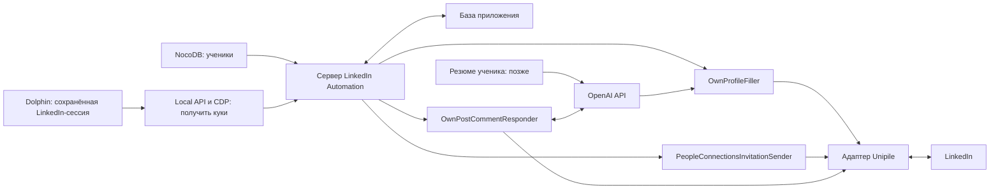

# LinkedIn Automation — предварительная архитектура

## Цель

`LinkedIn Automation` автоматизирует работу с собственными LinkedIn-профилями
учеников. Управление идёт из существующей Web Console, а все обращения к
LinkedIn выполняются на сервере.

В этом PR находится только предварительная архитектура. Код, тестовые заготовки,
реальные запросы, развёртывание и изменение NocoDB в него не входят.

## Общая схема



## Компоненты

| Компонент | Задача |
| --- | --- |
| Подключение аккаунта | Получить куки из Dolphin через CDP, подключить Unipile и проверить владельца профиля |
| Student Admin | Связать ученика, Dolphin-профиль и LinkedIn-аккаунт |
| OwnProfileFiller | Показать и применить подтверждённые изменения собственного профиля |
| PeopleConnectionsInvitationSender | Найти кандидатов и отправить приглашения без повторов |
| OwnPostCommentResponder | Найти новые комментарии к постам ученика и подготовить или отправить ответ |
| Адаптер Unipile | Скрыть детали внешнего API от бизнес-компонентов |

## Подключение аккаунта

1. Сервер находит привязанный Dolphin-профиль.
2. Запускает или находит открытый профиль и подключается к нему через CDP.
3. Получает куки LinkedIn.
4. Передаёт куки в Unipile для подключения или восстановления аккаунта.
5. Читает собственный профиль и проверяет, что подключён нужный ученик.

Tampermonkey и отдельная форма логина/2FA не используются. Куки не уходят в
интерфейс и не сохраняются в базе приложения.

Подробнее: [DOLPHIN_COOKIE_CONNECTION.md](account-connection/docs/DOLPHIN_COOKIE_CONNECTION.md).

## Общие правила

- Бизнес-компоненты работают только с проверенным `ConnectedAccount`.
- Все изменения одного аккаунта выполняются последовательно.
- После изменения выполняется повторное чтение результата.
- Неопределённый результат не повторяется вслепую.
- NocoDB остаётся источником карточек учеников.
- Задания, настройки и история автоматизации хранятся отдельно от NocoDB.
- Куки и ключи API не попадают в логи, отчёты и интерфейс.

## Структура документов

```text
src/features/linkedin-automation/
  ARCHITECTURE.md
  account-connection/docs/
    DOLPHIN_COOKIE_CONNECTION.md
    ACCOUNT_LIFECYCLE.md
  core/
    safety/LINKEDIN_LIMITS.md
    storage/DATA_BOUNDARIES.md
  profile-filler/
    ARCHITECTURE.md
    docs/QUEUE_FLOW.md
  connection-inviter/ARCHITECTURE.md
  comment-monitor/ARCHITECTURE.md
  student-admin/ARCHITECTURE.md

src/integrations/unipile/
  ARCHITECTURE.md
```

## Что ещё нужно решить

- Вычитать существующую матрицу возможностей профиля и при необходимости
  повторить проверку через Unipile.
- Утвердить с Полиной и Кирой частоту проверки комментариев.
- Определить, когда ответ ИИ публикуется автоматически, а когда требует подтверждения.
- Выбрать базу приложения и правила хранения резюме и контекста для ИИ.
