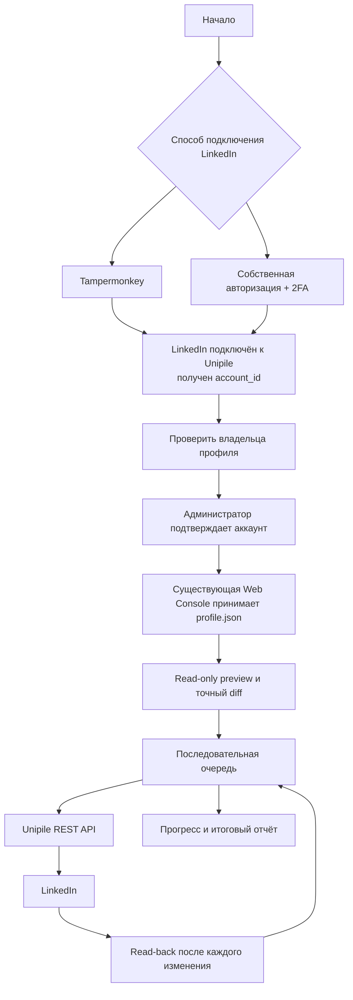

# LinkedIn Automation — архитектура

## Статус

`LinkedIn Automation` — отдельная локальная фича внутри текущего репозитория.
Она объединяет независимые блоки автоматизации LinkedIn. Реализованный первый
блок — `Profile Filler`; следующие запланированные блоки —
`Connection Inviter` и `Comment Monitor`.

- Локальная ветка: `feature/linkedin-profile-filler-web`.
- Commit, push, PR и deployment без отдельного подтверждения запрещены.
- Способ подключения LinkedIn пока не выбран.
- Аутентификацию пока не реализуем.
- VDS является будущей средой выполнения, а не названием бизнес-фичи.

## Расположение

```text
src/features/linkedin-automation/
  ARCHITECTURE.md
  AGENTS.md
  core/
    account/
      connected-account.ts
    jobs/
      job-types.ts
    safety/
      timing-policy.ts
      redaction.ts
    reporting/
      step-result.ts
  account-connection/
    docs/
      AUTHENTICATION_OPTIONS.md
  connection-inviter/
    ARCHITECTURE.md
  comment-monitor/
    ARCHITECTURE.md
  profile-filler/
    ARCHITECTURE.md
    types.ts
    validator.ts
    profile-snapshot.ts
    planner.ts
    preview-store.ts
    job-manager.ts
    service.ts
    executor.ts
    report.ts
    state.ts
    docs/
      QUEUE_FLOW.md
      PROFILE_JSON.md
    tests/
    fixtures/

src/integrations/unipile/
  client.ts
```

Сейчас в Unipile integration существует только `client.ts`. Возможное будущее
разделение на `auth.ts`, `profile.ts`, `search-parameters.ts`, `errors.ts` и
`tests/` выполняется по мере роста клиента, а не создаётся заранее.

`src/integrations/unipile` остаётся отдельно, потому что это адаптер внешнего
сервиса, а не бизнес-блок Profile Filler.

## Главная схема

Внутренняя реализация способов подключения намеренно не раскрывается. Пока это
два равноправных заменяемых блока.



Коротко:

```text
Tampermonkey ─────────┐
                      ├→ ConnectedAccount → Profile Filler → Unipile → LinkedIn
Собственная 2FA ──────┘                                      ← read-back ←
```

## Граница подключения аккаунта

Следующие блоки не должны знать, как именно был подключён LinkedIn. Они получают
только проверенный результат:

```text
ConnectedAccount
|- accountId
|- displayName
|- profileUrl
`- verifiedAt
```

На границе Unipile поле `account_id` преобразуется во внутреннее `accountId`.

Кандидаты:

- `Tampermonkey`: готовая авторизованная браузерная сессия;
- `Собственная авторизация + 2FA`: собственный credentials/checkpoint flow.

До отдельного решения запрещено реализовывать auth endpoints, формы credentials,
постоянное хранение LinkedIn password/TOTP secret, checkpoint automation и
reconnect workflow. Backend Profile Filler при этом может временно получать
данные текущей LinkedIn-сессии для подключения или восстановления связи; они не
передаются в browser responses, preview или отчёты.

Подробная схема вариантов: [AUTHENTICATION_OPTIONS.md](account-connection/docs/AUTHENTICATION_OPTIONS.md).

## Компонентные границы

```text
LinkedIn Automation
  -> account connection strategy boundary
  -> shared core
     -> connected account contract
     -> job state contracts
     -> timing policy and secret redaction
     -> common step result
  -> Profile Filler
     -> validator / normalizer
     -> current-profile reader
     -> diff planner
     -> preview confirmation
     -> in-memory job manager
     -> ordered executor
     -> read-back verifier
  -> Connection Inviter
     -> daily queue and persistent history
  -> Comment Monitor
     -> live personal-post catalog
     -> 48-hour post watches
     -> hourly comments and replies poller
     -> notify / draft / auto-reply policy
     -> send reconciliation and audit
  -> Unipile integration facade
  -> Unipile V2
  -> LinkedIn Classic
  -> existing Web Console integration
```

`core` содержит только общие контракты и политики, которые смогут повторно
использовать блоки LinkedIn Automation. Логика конкретных разделов профиля
остаётся внутри `profile-filler`, дневная очередь приглашений и постоянная
история — внутри `connection-inviter`, а мониторинг постов и комментариев —
внутри `comment-monitor`.

Существующая Web Console является единственным UI: отдельное приложение внутри
`profile-filler` не создаётся. Frontend никогда не обращается напрямую к
Unipile или LinkedIn. Секреты,
provider payloads, очередь, интервалы и read-back находятся на backend.

## Изоляция

Разрешённая область работы:

```text
src/features/linkedin-automation/**
src/integrations/unipile/**
src/features/web-console/**  # только LinkedIn-specific integration points
```

Остальной репозиторий read-only, включая `package.json`, корневую конфигурацию,
NocoDB, HH, Dolphin, Telegram и CV flows. В Web Console разрешены только
минимальные LinkedIn-specific routes, services, views и tests без изменения
поведения существующих разделов.

## Стек

- Node.js и TypeScript;
- Express для backend API;
- Vue 3, Vite и PrimeVue для Web UI;
- Unipile V2 REST API для runtime;
- официальный Unipile MCP только для разработки и проверки документации;
- встроенный `node:crypto` для plan hash, IDs и случайных интервалов;
- fake Unipile responses и Playwright для тестирования.

Новые зависимости и изменения `package.json` до отдельного согласования не
добавляются.

## Unipile MCP

```text
https://developer.unipile.com/mcp?branch=v1.0
```

MCP не участвует в production/runtime потоке. Его `X-API-KEY` передаётся через
secret storage MCP-клиента и никогда не записывается в репозиторий.

## Безопасность

Запрещено логировать, сохранять в отчёты или возвращать во frontend:

- LinkedIn cookies и passwords;
- Unipile API keys;
- proxy username/password;
- полные authentication payloads.

Будущий специализированный auth frontend может принимать и показывать TOTP
secret и одноразовые 2FA-коды. Их нельзя помещать в URL, логи, analytics,
`localStorage`, `sessionStorage`, отчёты или fixtures. После отправки или
истечения срока значение очищается из памяти компонента.

Raw LinkedIn credentials могут кратковременно существовать только на backend и
могут использоваться для session-to-account binding. Они не сохраняются в
отчётах, frontend storage или browser responses. Любой полученный `account_id`
обязательно подтверждается чтением текущей публичной identity.

## Размещение на VDS

VDS — будущая deployment/runtime среда. Конкретные SSH, service, container,
reverse proxy, HTTPS и secret-storage решения сейчас не определяются и не
реализуются. Сначала модуль разрабатывается локально через существующую Web
Console, без deployment.

## Текущий этап

До выбора auth strategy разрешена реализация Profile Filler и его подключения к
существующей Web Console без создания auth UI:

- контрактом `profile.json`;
- validator/normalizer;
- diff planner и preview;
- job model и последовательной очередью;
- fake executor и read-back verifier;
- redaction и тестами.

Архитектура самого блока: [profile-filler/ARCHITECTURE.md](profile-filler/ARCHITECTURE.md).

Архитектура будущей дневной отправки приглашений:
[connection-inviter/ARCHITECTURE.md](connection-inviter/ARCHITECTURE.md).

Архитектура мониторинга комментариев к личным постам:
[comment-monitor/ARCHITECTURE.md](comment-monitor/ARCHITECTURE.md).
