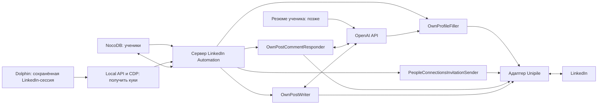

# LinkedIn Automation

## Цель

`LinkedIn Automation` автоматизирует работу с собственными LinkedIn-профилями
учеников. Управление идёт из существующей Web Console, а все обращения к
LinkedIn выполняются на сервере.

Первая реализованная часть — CLI подключения LinkedIn через Dolphin и Unipile v2.

## Общая схема



## Компоненты

| Компонент | Задача |
| --- | --- |
| Подключение аккаунта | Получить куки из Dolphin через CDP, подключить Unipile и проверить владельца профиля |
| Student Admin | Связать ученика, Dolphin-профиль и LinkedIn-аккаунт |
| OwnProfileFiller | Показать и применить подтверждённые изменения собственного профиля |
| PeopleConnectionsInvitationSender | Найти кандидатов и отправить приглашения без повторов |
| OwnPostCommentResponder | Найти новые комментарии к постам ученика и подготовить или отправить ответ |
| OwnPostWriter | По ручному запуску автоматически создать, проверить и опубликовать пост |
| Адаптер Unipile | Скрыть детали внешнего API от бизнес-компонентов |

## Подключение аккаунта

1. CLI находит LinkedIn-строку и единственный Dolphin-профиль с locale `En`.
2. Проверяет обязательный proxy; при отсутствии запрашивает, создаёт и привязывает его в Dolphin.
3. Атомарно блокирует и перезапускает профиль.
4. Через CDP получает только `li_at` и точный `navigator.userAgent`.
5. Создаёт Unipile v2 Auth Intent с продуктом `classic` и прокси Dolphin.
6. Читает собственный профиль, проверяет URL и неизменность provider ID.
7. Сохраняет безопасную связь и статус в `platform_accounts` NocoDB.

Tampermonkey и отдельная форма логина/2FA не используются. Cookie, user-agent и
пароль прокси не сохраняются и не выводятся. `AuthenticationCheckpoint`
восстанавливается вручную в Dolphin.

Подробнее: [DOLPHIN_COOKIE_CONNECTION.md](account-connection/docs/DOLPHIN_COOKIE_CONNECTION.md).

## Общие правила

- Бизнес-компоненты работают только с проверенным `ConnectedAccount`.
- Все изменения одного аккаунта выполняются последовательно.
- После изменения выполняется повторное чтение результата.
- Неопределённый результат не повторяется вслепую.
- NocoDB хранит карточки учеников, LinkedIn-привязки и постоянное состояние автоматизации.
- Настройки, задания и история каждой функции находятся в отдельных таблицах NocoDB.
- Оперативный кэш backend не является источником истины.
- Куки и ключи API не попадают в логи, отчёты и интерфейс.

## Структура документов

```text
src/features/linkedin-automation/
  ARCHITECTURE.md
  account-connection/docs/
    DOLPHIN_COOKIE_CONNECTION.md
    ACCOUNT_LIFECYCLE.md
  core/
    safety/LINKEDIN_LIMITS.md
    storage/DATA_BOUNDARIES.md
  profile-filler/
    ARCHITECTURE.md
    docs/QUEUE_FLOW.md
  connection-inviter/ARCHITECTURE.md
  comment-monitor/ARCHITECTURE.md
  post-writer/
    ARCHITECTURE.md
    CONTENT_POLICY.md
  student-admin/ARCHITECTURE.md

src/integrations/unipile/
  ARCHITECTURE.md
```

## Что ещё нужно решить

- Вычитать существующую матрицу возможностей профиля и при необходимости
  повторить проверку через Unipile.
- Утвердить с Полиной и Кирой частоту проверки комментариев.
- Определить, когда ответ ИИ публикуется автоматически, а когда требует подтверждения.
