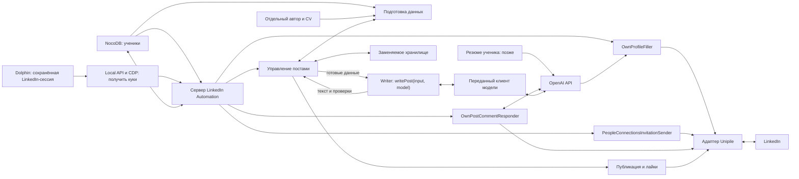

# LinkedIn Automation

## Цель

`LinkedIn Automation` автоматизирует работу с собственными LinkedIn-профилями
учеников. Управление идёт из существующей Web Console, а все обращения к
LinkedIn выполняются на сервере.

Первая реализованная часть — CLI подключения LinkedIn через Dolphin и Unipile v2.

## Общая схема


```mermaid
flowchart LR
    N["NocoDB: ученики"] --> B["Сервер LinkedIn Automation"]
    D["Dolphin: сохранённая LinkedIn-сессия"] --> C["Local API и CDP: получить куки"]
    C --> B
    B <--> N

    B --> PF["OwnProfileFiller"]
    B --> CI["PeopleConnectionsInvitationSender"]
    B --> CR["OwnPostCommentResponder"]
    B --> PC["Управление постами"]
    N --> PD["Подготовка данных"]
    CUSTOM["Отдельный автор и CV"] --> PD
    PC <--> PD
    PC -->|готовые данные| PW["Writer: writePost(input, model)"]
    PW -->|текст и проверки| PC
    PC <--> PS["Заменяемое хранилище"]
    PC --> PP["Публикация и лайки"]

    PF --> U["Адаптер Unipile"]
    CI --> U
    CR --> U
    PP --> U
    U <--> L["LinkedIn"]

    CV["Резюме ученика: позже"] --> O["OpenAI API"]
    O --> PF
    CR <--> O
    PW <--> MODEL["Переданный клиент модели"]
    MODEL <--> O
```

## Компоненты

| Компонент | Задача |
| --- | --- |
| Подключение аккаунта | Получить куки из Dolphin через CDP, подключить Unipile и проверить владельца профиля |
| Student Admin | Связать ученика, Dolphin-профиль и LinkedIn-аккаунт |
| OwnProfileFiller | Показать и применить подтверждённые изменения собственного профиля |
| PeopleConnectionsInvitationSender | Найти кандидатов и отправить приглашения без повторов |
| OwnPostCommentResponder | Найти новые комментарии к постам ученика и подготовить или отправить ответ |
| Подготовка данных поста | Получить CV из Noco или загрузки, собрать факты и контекст |
| Writer (OwnPostWriter) | Получить готовый контекст и модель, вернуть текст и проверки |
| Управление постами | Хранить задания, расписание, подтверждения, Stop и прогресс |
| Публикация и лайки | Отправить готовый текст через Unipile и проверить результат |
| Адаптер Unipile | Скрыть детали внешнего API от бизнес-компонентов |

## Подключение аккаунта

1. CLI находит LinkedIn-строку и единственный Dolphin-профиль с locale `En`.
2. Проверяет обязательный proxy; при отсутствии запрашивает, создаёт и привязывает его в Dolphin.
3. Атомарно блокирует и перезапускает профиль.
4. Через CDP получает только `li_at` и точный `navigator.userAgent`.
5. Создаёт Unipile v2 Auth Intent с продуктом `classic` и прокси Dolphin.
6. Читает собственный профиль, проверяет URL и неизменность provider ID.
7. Сохраняет безопасную связь и статус в `platform_accounts` NocoDB.

Tampermonkey и отдельная форма логина/2FA не используются. Cookie, user-agent и
пароль прокси не сохраняются и не выводятся. `AuthenticationCheckpoint`
восстанавливается вручную в Dolphin.

Подробнее: [DOLPHIN_COOKIE_CONNECTION.md](account-connection/docs/DOLPHIN_COOKIE_CONNECTION.md).

## Общие правила

- Обращения к LinkedIn требуют проверенного `ConnectedAccount`; подготовка текста Post Writer не требует подключения аккаунта.
- Все изменения одного аккаунта выполняются последовательно.
- После изменения выполняется повторное чтение результата.
- Неопределённый результат не повторяется вслепую.
- NocoDB хранит карточки учеников, LinkedIn-привязки и постоянное состояние автоматизации.
- Настройки, задания и история LinkedIn-функций находятся в отдельных таблицах NocoDB.
- Отдельный текстовый Post Writer хранит авторов, CV и историю локально через заменяемый
  файловый адаптер. Он не публикует и не требует Noco, Dolphin или LinkedIn.
- Оперативный кэш backend не является источником истины.
- Куки и ключи API не попадают в логи, отчёты и интерфейс.

## Структура документов

```text
src/features/linkedin-automation/
  ARCHITECTURE.md
  account-connection/docs/
    DOLPHIN_COOKIE_CONNECTION.md
    ACCOUNT_LIFECYCLE.md
  core/
    safety/LINKEDIN_LIMITS.md
    storage/DATA_BOUNDARIES.md
  profile-filler/
    ARCHITECTURE.md
    docs/QUEUE_FLOW.md
  connection-inviter/ARCHITECTURE.md
  comment-monitor/ARCHITECTURE.md
  post-writer/
    ARCHITECTURE.md
    CONTENT_POLICY.md
  student-admin/ARCHITECTURE.md

src/integrations/unipile/
  ARCHITECTURE.md
```

## Надёжность отправок и внутренние шаги

- `execution-step.ts` описывает результат шага: `ready`, `waiting`, `verifying`,
  `completed`, `stopped`, `needs_attention`, срок следующего действия и причину.
  Перед передачей управления внешних запросов в полёте нет, состояние сохранено.
  Ошибка хранилища не разрешает следующий POST.
- Комментарии сохраняют `attemptedAt` до POST и `replyId` до проверочного GET.
  Известный ID имеет приоритет. Без ID подходят только собственные ответы того же
  родительского комментария с точным текстом и временем не раньше попытки;
  отсутствие даты или несколько совпадений оставляют результат неизвестным.
  Неизвестные ответы проверяются после выключения/истечения сессии: раз в минуту
  первые 10 минут, затем через 15, 30, 60 минут и далее ежечасно. Срок Unipile
  имеет приоритет. Новая сессия сохраняет дедупликацию и не обходит неизвестные отправки.
  Один `pollMonitorJob` отправляет максимум один новый ответ; оставшаяся очередь и
  обычная пауза 45–120 секунд сохраняются, аккаунт на время паузы освобождается.
- У Post Writer `accountActive` учитывает публикацию автора отдельно от лайков
  опубликованного поста. Проверка неизвестного лайка удерживает его исполнителя;
  история, дневные ключи и нынешний способ выбора аккаунтов не меняются.
- Unipile передаёт полный `Retry-After` и абсолютный `retryAt`. Повторная обработка
  того же ответа и время сохранения состояния не прибавляются к ожиданию.
  Автоматических повторов POST HTTP-клиент не делает.
- `connectionSteps` позволяет продолжать тот же прогон после прочитанной порции
  кандидатов или сохранённого результата. При передаче управления сохраняются
  очередь, квота и следующий срок, освобождается блокировка аккаунта. Обычный
  ручной исполнитель использует этот же код непрерывно: без лишних сохранений
  при отсутствии передачи управления, с прежним бюджетом запросов хранилища.
- `withdrawalSteps` работает с сохранёнными `targets`, `cursor`, `approvedAccount`,
  подтверждёнными и неопределёнными попытками. Внутренний `resume` продолжает только
  этот список после проверки начатого. Stop сохраняется; старый журнал без списка
  допускает сверку отправленного, но остаток обозначается как прерванный.
  Подтверждение списка, возраст строго больше 14 суток и пакетная проверка остаются.
- 30 дней относятся только к диагностическим JSONL-логам (`log-retention.ts`).
  Задания, история, квоты и защита от дублей не удаляются по возрасту. Новые поля
  состояния необязательны; смена схемы БД не требуется.

Общий координатор, ограничения между фичами, SQL-журнал, календарь и управление
описаны в `orchestrator/ARCHITECTURE.md`. Для включения на новом backend отдельно
применяется миграция оркестратора; существующие расписания не включаются автоматически.

## Ошибка сервиса во время действия

После первого HTTP 5xx у логического действия сохраняется окно восстановления
20 минут (`action-recovery.ts`). Перезапуск и новые ответы 500 не сдвигают начало.
По истечении окна приглашения, отзывы, ответы и лайки переходят к следующему
получателю; публикация пропускается. Неизвестный результат остаётся в истории,
занимает свою квоту и запрещает повторный POST. Обычные неподтверждённые результаты
без 5xx и ошибки 429 продолжают использовать прежнюю политику проверки.

Обязательную проверку аккаунта или общего списка нельзя обойти: если она не
восстановилась, завершается соответствующая фича с неполным результатом.
Независимые фичи продолжаются. Зависимые комментарии не ждут бесконечно
пропущенную публикацию. Retry-After ограничивает внешние запросы, но не локальное
сохранение решения о пропуске; пауза `action` действует только между шагами.

Итог содержит выполненное, пропущенное и неподтверждённое. В журнале остаются
ученик, фича, действие, этап, источник, HTTP-код, безопасное описание провайдера
и ID запроса. Дополнительные поля сохраняются в существующем JSON-состоянии;
миграция схемы не нужна.

## Что ещё нужно решить

- Вычитать существующую матрицу возможностей профиля и при необходимости
  повторить проверку через Unipile.
- Утвердить с Полиной и Кирой частоту проверки комментариев.
- Определить, когда ответ ИИ публикуется автоматически, а когда требует подтверждения.
