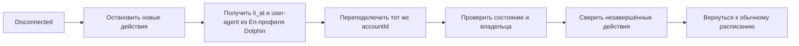

# Состояния LinkedIn-аккаунта

Перед запуском любого действия сервер проверяет состояние Unipile-аккаунта и
личность владельца.

| Состояние | Что делает система |
| --- | --- |
| `running` | Разрешает задания после проверки владельца |
| `disconnected` | Останавливает новые изменения и запускает переподключение |
| `errored` | Ставит аккаунт на паузу до восстановления сервиса |
| `partial` / `degraded` | Останавливает изменения до восстановления Classic |

## Переподключение

## Правила

- Используется тот же `accountId`; новый ID требует ручной проверки.
- Для `running` обычный запуск только проверяет владельца и синхронизирует NocoDB.
- Принудительный сбор новой сессии выполняется с `--force-reauth --apply`.
- `is_locked=true` и любой Classic-статус кроме `running` запрещают работу.
- `AuthenticationCheckpoint` не продолжается автоматически: сессию восстанавливают в Dolphin.
- Действие с неизвестным результатом получает статус `uncertain`.
- Такое действие нельзя повторять без проверки LinkedIn.
- После простоя не создаётся увеличенная догоняющая пачка.
- История приглашений, комментариев и изменений профиля сохраняется.

Источник куки описан в
[DOLPHIN_COOKIE_CONNECTION.md](DOLPHIN_COOKIE_CONNECTION.md).

## Логирование

- Логи охватывают подготовку до отправки данных в Unipile.
- Этапы: NocoDB → Dolphin → прокси → CDP → LinkedIn → проверка сессии → готовность к API → cleanup.
- Подробные логи сохраняются в `logs/linkedin-auth/`, короткий прогресс выводится в `stderr`.
- `li_at`, точный user-agent, API-ключ и данные прокси не сохраняются.
- Ошибка записи лога не останавливает авторизацию.
- В NocoDB сохраняется только итоговый статус, а не история логов.
