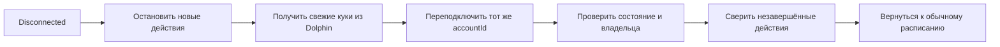

# Состояния LinkedIn-аккаунта

Перед запуском любого действия сервер проверяет состояние Unipile-аккаунта и
личность владельца.

| Состояние | Что делает система |
| --- | --- |
| `running` | Разрешает задания после проверки владельца |
| `disconnected` | Останавливает новые изменения и запускает переподключение |
| `errored` | Ставит аккаунт на паузу до восстановления сервиса |
| `paused` | Ждёт исправления подписки или конфигурации |

## Переподключение

## Правила

- Используется тот же `accountId`; новый ID требует ручной проверки.
- Действие с неизвестным результатом получает статус `uncertain`.
- Такое действие нельзя повторять без проверки LinkedIn.
- После простоя не создаётся увеличенная догоняющая пачка.
- История приглашений, комментариев и изменений профиля сохраняется.

Источник куки описан в
[DOLPHIN_COOKIE_CONNECTION.md](DOLPHIN_COOKIE_CONNECTION.md).
