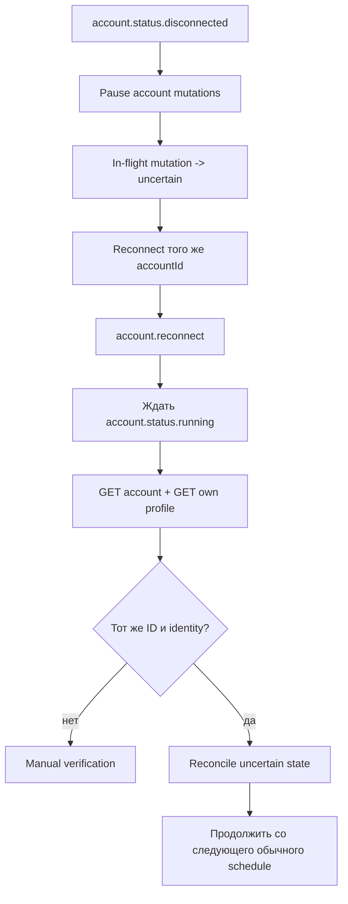

# LinkedIn account lifecycle

## Канонические состояния

Application хранит последнее известное состояние, но перед запуском мутаций
проверяет аккаунт через Unipile.

| Unipile status | Значение для automation | Действие |
| --- | --- | --- |
| `running` | Аккаунт доступен | Проверить identity и разрешить jobs |
| `disconnected` | Credentials устарели/отозваны | Остановить новые мутации, запросить reconnect |
| `errored` | Временная проблема Unipile/provider/proxy | Пауза без re-auth, ждать восстановления |
| `paused` | Нет активной subscription | Пауза до исправления billing/configuration |

Webhook ускоряет реакцию, но не является единственным источником истины. Перед
дневным run и после recovery выполняются `GET account` и identity read.

## Новый аккаунт и reconnect — разные сценарии

Новый аккаунт после успешного auth intent сразу возвращается как `running`.
Сигнал готовности — объект `Account`/`account.add`; ждать
`account.status.running` для нового аккаунта не нужно.

Для существующего аккаунта:

`account.reconnect` подтверждает повторную аутентификацию, но не готовность к
работе. Для восстановления существующего аккаунта рабочий сигнал —
`account.status.running` плюс успешный health check.

## Что происходит в момент обрыва

Account-level coordinator атомарно запрещает новые mutation claims. Уже
захваченные, но не отправленные jobs возвращаются в безопасное состояние.
Мутация, для которой сетевой запрос мог уйти, становится `uncertain`.

Запрещено:

- считать timeout доказанным отказом;
- повторять POST/PATCH вслепую;
- переключаться на новый `accountId` только потому, что он появился в Unipile;
- запускать накопившуюся catch-up пачку после восстановления.

## Reconciliation по фичам

| Фича | Проверка после recovery | Продолжение |
| --- | --- | --- |
| Profile Filler | Прочитать изменяемый раздел и сравнить с plan | Только после доказанного результата; иначе manual |
| Connection Inviter | Сверить sent invitations и relation/profile state | Историю не очищать; `uncertain` не отправлять повторно |
| Comment Monitor | Перечитать активные watches, comments и replies | Продолжить только до исходного `expiresAt` |

Пропущенный дневной run Connection Inviter переносится на следующий обычный
день без увеличения лимита. Окно Comment Monitor не продлевается из-за простоя.

## Webhook endpoint

- принимает только подписанные события;
- проверяет `unipile-signature` по raw body через HMAC SHA-256 и constant-time
  comparison;
- отклоняет старый timestamp согласно server policy;
- дедуплицирует события по event ID;
- быстро возвращает `2xx`, а reconciliation выполняет асинхронно;
- неизвестные новые event types безопасно игнорирует и логирует метаданные.

Поскольку доступность `relation.new` для LinkedIn расходится между отдельными
страницами документации Unipile, архитектура рассматривает это событие только
как подсказку. Источником доказательства остаются read-back и периодическая
сверка sent invitations/relations.

## Decision gate

Этот документ определяет реакцию приложения, но не реализует reconnect.
Конкретный ввод credentials/cookies, checkpoints и 2FA зависит от решения в
[AUTHENTICATION_OPTIONS.md](AUTHENTICATION_OPTIONS.md).

Официальные источники:

- [Connection Status](https://developer.unipile.com/v2.0/docs/status-lifecycle)
- [Event types](https://developer.unipile.com/v2.0/reference/event-types-1)
- [Configure a webhook](https://developer.unipile.com/v2.0/docs/configure-a-webhook)
- [Manage invitations](https://developer.unipile.com/v2.0/docs/linkedin-manage-invitations)
