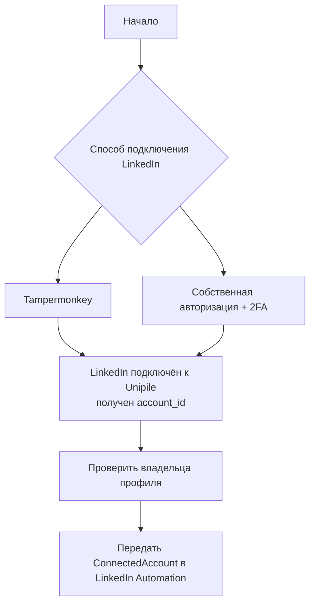

# LinkedIn connection options

Authentication design is intentionally unresolved. Both candidates are shown as
single replaceable blocks; neither is selected for the Web Console yet.



Shared internal output:

```text
ConnectedAccount
|- accountId
|- displayName
|- profileUrl
`- verifiedAt
```

The Unipile response field `account_id` is mapped to internal `accountId`.

Backend LinkedIn Automation modules may temporarily receive current session
credentials when they need to establish or restore the connection. Credentials
must not enter browser responses, preview plans, logs, analytics, reports,
fixtures, `localStorage`, or `sessionStorage`.

Do not add auth endpoints, persistent credentials, checkpoint automation, or
the credential-side reconnect flow until one option and its security model are
approved.

The application-side reaction to status changes is already auth-neutral and is
defined in [ACCOUNT_LIFECYCLE.md](ACCOUNT_LIFECYCLE.md). That document does not
select or implement either authentication option.

A future dedicated auth frontend may accept or display a TOTP secret and
one-time 2FA codes. Keep these values ephemeral and clear them from component
memory after submission or expiry.
