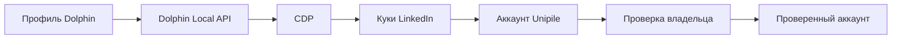

# Подключение LinkedIn через Dolphin CDP

## Решение

Для авторизации используется сохранённая LinkedIn-сессия в профиле Dolphin.
Сервер запускает или находит этот профиль через Dolphin Local API, подключается
к нему через CDP и получает свежие куки. Tampermonkey и отдельная форма
логина/2FA не нужны.

## Что сохраняем

- `studentId`;
- `dolphinProfileId`;
- `accountId` Unipile;
- проверенное имя и URL профиля;
- время последней проверки.

Значения куки не сохраняются и не возвращаются в интерфейс.

## Что проверить перед реализацией

- получение свежих куки из существующей сессии браузера;
- подключение и переподключение Unipile с этими куки;
- повторную проверку владельца после переподключения;
- поведение, если Dolphin-профиль остановлен или LinkedIn-сессия истекла.

Состояния аккаунта: [ACCOUNT_LIFECYCLE.md](ACCOUNT_LIFECYCLE.md).
