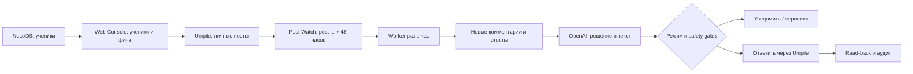

# Comment Monitor — архитектура

## Назначение

`Comment Monitor` следит только за личными LinkedIn-постами подключённых
учеников, находит новые комментарии и ответы в течение 48 часов после включения
мониторинга и либо уведомляет администратора, либо готовит/публикует ответ.

Зафиксированные решения:

- Web Console — единственный интерфейс управления;
- список личных постов загружается из Unipile в реальном времени;
- посты не копируются в NocoDB;
- отслеживаются верхнеуровневые комментарии и ответы;
- мониторинг включается вручную для выбранного поста или автоматически при
  обнаружении нового поста;
- окно мониторинга — ровно 48 часов от `startedAt`;
- режимы обработки: `notify`, `draft`, `auto_reply`.

## Короткая схема



Канонический идентификатор поста — непрозрачный `post.id`, полученный от
Unipile. Текст, дата публикации и URL используются только для отображения и не
заменяют provider ID.

## Границы данных

### NocoDB

NocoDB остаётся бизнес-источником учеников. В нём не хранятся посты,
комментарии, ответы, задания worker или OpenAI payloads. Существующие таблицы
не меняются на этапе архитектуры.

### Application DB

Для runtime-состояния требуется отдельная долговечная БД приложения; целевой
вариант — PostgreSQL. Конкретное подключение и миграции согласуются отдельной
задачей.

Минимальные сущности:

```text
linkedin_accounts
  student_id, unipile_account_id, status, verified_identity

student_features
  student_id, feature, enabled, settings

post_watches
  id, student_id, account_id, provider_post_id, source
  response_mode, started_at, expires_at, status
  last_comments_count, last_polled_at

comments
  watch_id, provider_comment_id, parent_comment_id
  author_id, text, first_seen_at, status
  generated_reply, sent_reply_id

automation_events
  student_id, feature, entity_id, event, safe_metadata, created_at
```

Ограничения уникальности:

- один `linkedin_accounts` на пару `student_id + unipile_account_id`;
- один `post_watch` на `account_id + provider_post_id`;
- один комментарий на `watch_id + provider_comment_id`.

История `post_watch` сохраняется после истечения срока. Это не каталог постов,
а минимальная защита от повторного запуска одного и того же 48-часового окна.

## Web Console

Отдельный раздел управления учениками показывает:

- ученика из NocoDB и связанный проверенный Unipile account;
- состояние подключения;
- включение/выключение всех LinkedIn-фич;
- режим Comment Monitor и автообнаружение;
- личные посты, загруженные live из Unipile;
- активные watches, новые комментарии, черновики и ошибки.

Frontend не получает API keys и не обращается к Unipile/OpenAI напрямую.
Текущий provider-список клиентов не считается полным реестром учеников:
административный каталог должен иметь отдельный backend contract.

## Активация поста

### Вручную

Администратор открывает live-список личных постов и включает мониторинг. Backend
атомарно создаёт или возвращает существующий `post_watch`:

```text
started_at = now
expires_at = started_at + 48 hours
source = manual
```

### Автоматически

Hourly worker получает личные посты аккаунта и создаёт watch только для постов,
опубликованных не раньше `auto_enabled_at`. Старые посты задним числом не
включаются. Ранее истёкший watch не запускается повторно.

Первый scan после ручного включения считает уже существующие комментарии
baseline: они сохраняются как увиденные, но автоматически не обрабатываются.
Исключение — watch, созданный вместе с публикацией поста: для него baseline
пустой.

## Polling

Текущая интеграционная модель использует polling, потому что отдельный webhook
для новых комментариев к посту не закладывается в контракт.

Worker раз в час:

1. выбирает активные watches с `expires_at > now`;
2. группирует их по Unipile account;
3. один раз получает личные посты аккаунта с полной пагинацией;
4. сравнивает provider-счётчик комментариев с сохранённым;
5. загружает все страницы изменившихся комментариев и ответов;
6. добавляет новые provider IDs через уникальные ограничения;
7. завершает watches после `expires_at`.

Оптимизацию по счётчику можно включить только после теста, подтверждающего, что
он меняется и для вложенных ответов. Иначе worker каждый час получает
комментарии и ответы каждого активного watch: пропуск reply хуже лишнего GET.
Собственные комментарии аккаунта (`is_sender`) не обрабатываются; ответ
разрешён только при положительном `can_reply`.

## Обработка комментария

```text
discovered
  -> claimed
  -> classified
  -> notified | drafted | sending
  -> sent -> verified
              `-> uncertain
  -> skipped | failed
```

OpenAI получает минимально необходимый контекст и возвращает структурированный
результат:

```json
{
  "action": "reply | notify | skip",
  "reply_text": "string | null",
  "confidence": 0.0,
  "risk_flags": ["string"],
  "language": "string"
}
```

Модель не вызывает Unipile и не принимает окончательное решение об отправке.
Backend применяет режим ученика, moderation, confidence threshold, allow/deny
policy и rate limits. Рискованный или неуверенный результат переводится в
уведомление/ручную проверку.

## Безопасная отправка

Для одного комментария разрешён только один атомарный claim. После отправки
ответа через Unipile обязателен read-back и сохранение provider reply ID.

POST ответа не получает слепых повторов. При timeout или неоднозначном ответе
запись переходит в `uncertain`: worker сначала сверяет ответы через read-back,
а затем требует ручного решения. Так система не публикует дубликаты.

Отключённый или неверифицированный аккаунт приостанавливает watches и создаёт
уведомление. API keys, cookies, credentials, полные provider payloads и
чувствительный prompt context не сохраняются в NocoDB, UI или audit log.

Перед публичным включением `auto_reply` обязательны production-auth Web Console,
роли администратора, CSRF/cookie hardening, server-side secret storage и
наблюдаемость ошибок. До этого безопасный режим по умолчанию — `notify`.

## Изменения Unipile integration

Будущий адаптер должен нормализовать и покрыть тестами:

- список личных постов аккаунта с пагинацией;
- список комментариев поста с пагинацией;
- список ответов к комментарию с пагинацией;
- публикацию ответа без общего retry middleware;
- read-back ответа;
- rate-limit, disconnect и provider errors.

Конкретные URL и provider payloads остаются внутри
`src/integrations/unipile/**`; бизнес-логика работает только с внутренними
типами Comment Monitor.

## Вне текущего этапа

- создание таблиц и миграций PostgreSQL;
- изменение NocoDB;
- реализация панели учеников;
- подключение OpenAI/Unipile runtime;
- deployment worker на VDS;
- включение live `auto_reply`.

Текущий результат — только согласованная архитектурная граница для следующей
итерации реализации.
