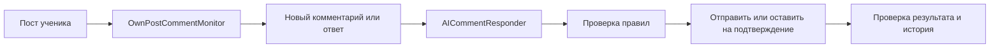

# OwnPostCommentResponder — предварительная архитектура

## Задача

Следить за комментариями к собственным LinkedIn-постам ученика и готовить ответ
с помощью ИИ. Отправку выполняет сервер через Unipile.

## Компоненты

| Компонент | Задача |
| --- | --- |
| `OwnPostCommentMonitor` | Найти новые комментарии и ответы к постам ученика |
| `AICommentResponder` | Получить текст поста и диалог, затем сгенерировать ответ через OpenAI API |
| `OwnPostCommentResponder` | Проверить правила, отправить разрешённый ответ и проверить результат |

## Схема

## Мониторинг

Отдельного webhook для новых комментариев в этой архитектуре нет.
`OwnPostCommentMonitor` имитирует его с помощью периодического опроса:

- проверяет только активные посты ученика;
- находит новые комментарии по ID LinkedIn;
- не обрабатывает собственные ответы ученика как новые входящие;
- немного сдвигает время каждого запуска, чтобы не опрашивать по жёсткому ритму;
- завершает наблюдение через 48 часов после его запуска.

Конкретную частоту опроса нужно утвердить с Полиной и Кирой.

## Ответ ИИ

`AICommentResponder` получает:

- текст исходного поста;
- новый комментарий;
- нужную часть диалога.

ИИ только предлагает текст. Сервер решает, можно ли его отправить, и не
повторяет запрос вслепую при неизвестном результате.

## Что нужно определить

- точную частоту опроса;
- автоматическая публикация или подтверждение администратора;
- правила тона, запрещённых тем и ручной проверки;
- срок хранения текста комментариев и черновиков ИИ.

Общие границы данных:
[DATA_BOUNDARIES.md](../core/storage/DATA_BOUNDARIES.md).
