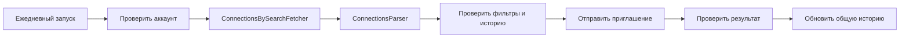

# PeopleConnectionsInvitationSender — предварительная архитектура

## Задача

Один раз в день найти подходящих людей и последовательно отправить приглашения
от имени ученика, не приглашая одного человека повторно.

## Компоненты

| Компонент | Задача |
| --- | --- |
| `ConnectionsBySearchFetcher` | Получить все нужные страницы поиска людей LinkedIn |
| `ConnectionsParser` | Превратить выдачу в список кандидатов с устойчивым `personId` |
| `PeopleConnectionsInvitationSender` | Проверить правила, историю, отправить приглашение и проверить результат |

## Схема

## Правила

- Не больше одного планового запуска в день на аккаунт.
- Используется одна история за всё время, а не отдельная история по неделям.
- Ключ повтора: `accountId + personId`.
- Если устойчивого `personId` нет, кандидат пропускается.
- Приглашения отправляются последовательно.
- Неизвестный результат сохраняется как `uncertain` и не повторяется вслепую.
- После простоя нет догоняющей пачки.

## Что нужно определить

- поисковые фильтры;
- дневной и недельный лимиты;
- разрешено ли добавлять текст к приглашению;
- рабочее окно и паузы между отправками.

Общие правила восстановления аккаунта:
[ACCOUNT_LIFECYCLE.md](../account-connection/docs/ACCOUNT_LIFECYCLE.md).
