# Connection Inviter

## Назначение

Администратор вручную запускает дневную норму LinkedIn-приглашений без сообщения. Норма зависит
от текущего числа connections, строго делится на 70% recruiters и 30% technical и не заменяет
одну аудиторию другой. Недельного hard cap нет; rolling seven-day показатель только информационный.

В фиче нет OpenAI и расписания. Единственный live writer явно включается переменными
`LINKEDIN_CONNECTION_WRITER_ENABLED=true` и `LINKEDIN_CONNECTION_WRITER_ID=<stable-id>`.

## Поток выполнения

```mermaid
flowchart LR
    U[Ручной запуск] --> G[Account-scoped operation gate]
    G --> R[Recovery и pending read-back]
    R --> A[Проверка account и дневной нормы]
    A --> S[Стабильно перемешанный полный каталог]
    S --> F[Детерминированный фильтр]
    F --> C[Noco atomic claim: sending]
    C --> P[Invitation POST без message]
    P --> B[Обязательный pending/profile read-back]
    B --> H[Noco lifetime history]
```



Поиск идёт до заполнения обеих квот или полного исчерпания каталога: максимум три cursor-страницы
на ключ. Recruiter-запросы не зависят от stack; technical-профили проверяются по stack. Порядок
ключей стабильно зависит от `runId`: сначала ещё не использованные, затем использованные ранее.

Обычный pacing: 5–15 секунд между search-запросами, 30–90 секунд после каждых пяти ключей и
15–180 секунд между invitation POST.

## Retry и безопасность mutation

Transient NocoDB/Unipile ошибки не завершают run. `ConnectionRetryState` хранит provider, operation,
attempt, error code, delay и время следующей попытки. Интервал растёт на 90 секунд: 90–180 секунд
для первой попытки, 180–270 для второй и так далее. После потолка используется 28,5–30 минут.
Явный `Retry-After` имеет приоритет и может быть больше 30 минут. Stop проверяется не реже раза
в секунду.

- Noco reads, idempotent patches и create-after-read-back повторяются автоматически.
- Unipile reads и Classic People Search POST считаются семантически read-only и повторяются.
- До invitation POST Noco обязан подтвердить `sending`; при недоступной Noco POST запрещён.
- Invitation `429` требует отрицательного pending read-back, затем сохраняется `deferred` и POST
  разрешается повторить после backoff.
- Timeout, unreachable и `5xx` переводят invitation в `uncertain`: повторяется только read-back,
  сам POST вслепую не повторяется.
- `2xx` без invitation в pending также остаётся в `resolving_uncertain` до достоверного результата.
- Детерминированный `4xx` отклоняет только кандидата.

Gate удерживается во время обычных и overload-таймеров, но scoped по LinkedIn account, поэтому
другие аккаунты могут работать. Если gate занят более приоритетной операцией того же аккаунта,
Inviter остаётся в `waiting_gate` и пробует снова, не прерывая её. После рестарта восстанавливаются сегодняшние `running`,
`waiting_retry`, `sending` и `resolving_uncertain`; сохранённый таймер сначала досчитывается.

## Состояние и NocoDB

- `linkedin_connection_search_catalog` — 400 поисковых шаблонов.
- `linkedin_connection_runs` — один run на `platformAccountId + localDate`.
- `linkedin_connection_history` — lifetime-запись на `accountId + personId`.

Run хранит retry/timer, cursor/search progress, агрегаты skip-причин, `next_action_at`, executor и
heartbeat. Небольшая очередь найденных eligible-кандидатов хранится внутри `search_progress_json`,
чтобы restart между search и preflight не терял страницу. Детерминированные skips не создают history rows; подробности остаются в безопасном JSONL,
а в Noco сохраняются агрегаты. Lifetime-блокируют только `sending`, `sent`, `pending`, `accepted` и
`uncertain`; старые mismatch-решения можно переоценить.

Если каталог исчерпан, итог — `status: partial`, `stage: search_exhausted` с точным недобором.
Повторный ручной запуск в тот же день начинает новый стабильный проход, но никогда не превышает
дневной предел.

## Realtime Web Console

`GET /api/admin/linkedin/connection-runs/:runId/events` — защищённый admin-session SSE endpoint.
Он отправляет snapshot, stage/progress/timer/retry/invitation и terminal events, а также keepalive
каждые 15 секунд. Браузер считает countdown локально; при недоступном SSE polling выполняется раз
в 15 секунд. Закрытие вкладки не останавливает backend executor.

Карточка показывает общий и audience progress, каталог, текущие город/страницу, найдено/eligible/
skipped, основные reason codes, текущий таймер, retry attempt, rolling seven-day sent и примерный ETA.

## Выпуск

```powershell
npm run typecheck
npm run linkedin:connections:test
npm run linkedin:connections:e2e
npm run web:test
npm run web:build
git diff --check
```

Noco rollout выполняется отдельно: backup → contract check → dry-run → apply → read-back. Затем
разрешена только live read-only проверка. Первый реальный invitation POST требует отдельного
подтверждения администратора.
