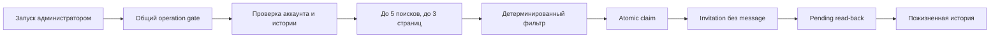

# Connection Inviter

## Назначение

MVP вручную отправляет дневную долю приглашений LinkedIn без сообщения. В нём
нет расписания, OpenAI и автоматического повторного запуска.

## Поток



## Модули

| Модуль | Ответственность |
| --- | --- |
| `catalog.ts` | 400 версионированных поисков: 200 recruiter и 200 technical |
| `limits.ts` | дневная норма, Пн–Пт и доля 70/30 |
| `policy.ts` | профиль, город, роль и stack |
| `relation-policy.ts` | вторая степень, существующая связь и pending |
| `discovery.ts` | cursor-пагинация и создание кандидатов |
| `publisher.ts` | preflight, POST без retry и read-back |
| `pending.ts` | сверка pending, `sent`, `accepted` и `uncertain` |
| `execution.ts` | единый безопасный сценарий запуска |

## Хранилище NocoDB

- `linkedin_connection_search_catalog` — общий каталог поисков.
- `linkedin_connection_runs` — один запуск на `platformAccountId + localDate`.
- `linkedin_connection_history` — один кандидат на `accountId + personId` за всё время.

Миграция идемпотентна и поддерживает `dry-run`, `apply` и read-back. Применение
схемы не является частью запуска приложения.

## Инварианты безопасности

- Поиск — только Classic People Search с `network_distance: [2]`.
- Неопределённая степень связи, неполный профиль или нестабильный ID дают `skip`.
- До POST проверяются общая история, pending и актуальный профиль.
- POST выполняется один раз без автоматического retry и без `message`.
- После POST приглашение должно появиться в pending; иначе запуск становится `uncertain`.
- `uncertain` блокирует дальнейшие отправки до read-back.
- Отправки последовательны, пауза каждый раз новая: 15–180 секунд.
- Пропущенные дни не догоняются, нехватка одной аудитории не замещается другой.
- При отсутствующем stack запуск стоит на паузе; safe mode разрешает только recruiters.

## Выпуск

```powershell
npm run linkedin:connections:test
npm run linkedin:connections:e2e
```

После кода отдельно выполняются backup NocoDB, contract check, dry-run, apply и
read-back. Live read-only проверка одного аккаунта обязательна до первого
приглашения; реальный POST требует отдельного подтверждения.
