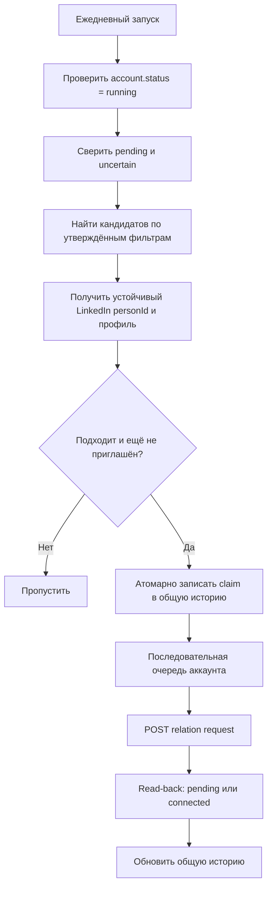
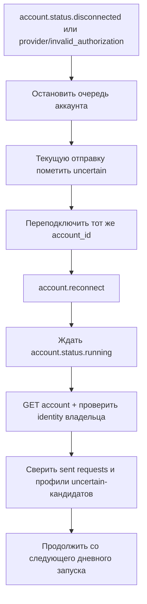

# LinkedIn Connection Inviter — архитектура блока

## Назначение и статус

`Connection Inviter` один раз в день подбирает подходящих людей и последовательно
отправляет им приглашения в LinkedIn через Unipile V2.

Сейчас это только локальная архитектура будущего spike:

- код блока, live-запросы и хранилище ещё не реализованы;
- публикации и сообщения после подключения не входят в scope;
- способ подключения и повторной авторизации LinkedIn пока не выбран;
- commit, push, PR и deployment требуют отдельного подтверждения.

## Зафиксированные решения

1. Планировщик запускается один раз в день для каждого подключённого аккаунта.
2. Размер дневной пачки задаётся server-side конфигурацией.
3. Недельной очереди и отдельного недельного списка нет.
4. Используется одна постоянная история за всё время, а не история по неделям.
5. Повторное приглашение той же паре `accountId + personId` запрещено.
6. При пропущенном запуске система не догоняет накопившуюся пачку.
7. Все отправки одного аккаунта выполняются последовательно.
8. Неопределённый результат отправки никогда не повторяется вслепую.

## Главная схема



Коротко:

```text
Daily scheduler
  -> account health
  -> reconciliation
  -> people search
  -> eligibility + permanent deduplication
  -> per-account sequential queue
  -> relation request
  -> read-back
  -> permanent history
```

## Компоненты

Целевая структура блока, пока без реализации:

```text
connection-inviter/
  ARCHITECTURE.md
  types.ts                 # candidate, history record, run and states
  daily-planner.ts         # один запуск в день, лимит и отсутствие catch-up
  candidate-source.ts      # поиск и чтение профиля через facade
  eligibility-policy.ts    # фильтры, connected/pending/history checks
  history-repository.ts    # порт постоянной общей истории
  job-manager.ts           # последовательная очередь на accountId
  reconciler.ts            # восстановление pending/uncertain
  service.ts               # orchestration
  tests/                   # только fake/local по умолчанию
```

Блок использует общие контракты `ConnectedAccount`, job states, timing и
redaction из `../core`. Запросы к провайдеру проходят только через
`src/integrations/unipile`; frontend никогда не обращается к Unipile напрямую.

## Общая история и защита от дублей

История должна быть постоянной и переживать рестарт процесса. In-memory
реализация разрешена только в тестах. Live-run запрещён, если durable history
недоступна.

Минимальная запись:

```text
ConnectionHistoryRecord
|- accountId
|- personId                 # устойчивый Unipile/LinkedIn user id
|- profileUrl?              # только вспомогательное поле
|- state
|- firstSeenAt
|- claimedAt?
|- requestSentAt?
|- lastCheckedAt
|- acceptedAt?
|- runId
`- safeError?

UNIQUE(accountId, personId)
```

Основные состояния:

```text
claimed -> sending -> pending -> accepted
                   +-> uncertain -> reconciliation/manual review
claimed -> failed_before_send -> следующий обычный дневной запуск
```

Перед `POST` сервис атомарно создаёт или захватывает запись истории. Конфликт
уникальности означает `skip`. Это защищает от двух параллельных запусков и от
повторной отправки после рестарта.

`profileUrl`, имя и поисковая позиция не используются как ключ: они могут
изменяться. Если устойчивый `personId` получить нельзя, кандидат пропускается.

## Ежедневный сценарий

1. Создать не более одного `daily run` на `accountId` и календарную дату.
2. Проверить состояние аккаунта и публичную identity владельца.
3. Сверить ранее незавершённые записи с LinkedIn через Unipile.
4. Выполнить people search по заранее утверждённым фильтрам.
5. Исключить уже connected, pending и всех, кто существует в общей истории.
6. Набрать не более `dailyLimit` кандидатов.
7. Для каждого кандидата: atomic claim → send → read-back → history update.
8. Остановить run при disconnect, provider rate limit или неопределённой
   системной ошибке.

`dailyLimit`, время запуска, timezone и интервалы между приглашениями задаются
только доверенной server-side конфигурацией. Клиентский запрос не может их
переопределить.

## Потеря и восстановление сессии



Правила восстановления:

- `account.reconnect` означает завершение повторной авторизации, но ещё не
  готовность аккаунта; рабочий сигнал — только `account.status.running`;
- переподключается существующий `account_id`; неожиданный новый ID блокирует
  автоматизацию до ручной проверки identity;
- `pending` и `accepted` остаются в истории навсегда и не отправляются повторно;
- `uncertain` сначала сверяется через список исходящих заявок и профиль;
- если результат нельзя доказать, запись остаётся `uncertain`, без auto-retry;
- запланированные, но не начатые кандидаты переносятся на следующий обычный
  дневной запуск; catch-up пачка не создаётся;
- `account.status.errored` не считается потерей credentials: очередь ждёт
  восстановления Unipile и события `account.status.running` без re-auth;
- `paused` требует исправления подписки/конфигурации, а не восстановления сессии.

Конкретный reconnect flow реализуется только после выбора auth strategy,
описанного в `../account-connection/docs/AUTHENTICATION_OPTIONS.md`.

## Контракт с Unipile V2

| Действие | Метод |
| --- | --- |
| Проверить аккаунт | `GET /v2/accounts/{account_id}` |
| Проверить владельца | `GET /v2/{account_id}/users/me` |
| Найти людей | `POST /v2/{account_id}/linkedin/search/people` |
| Получить профиль | `GET /v2/{account_id}/users/{user_id}` |
| Отправить приглашение | `POST /v2/{account_id}/users/me/relation-requests` |
| Получить исходящие заявки | `GET /v2/{account_id}/users/me/relation-requests?type=sent` |

Используемые события:

- `account.status.disconnected` — остановить account queue;
- `account.reconnect` — повторная авторизация произошла, но очередь не запускать;
- `account.status.running` — можно начинать health check и reconciliation;
- `relation.new` — обновить историю после принятия приглашения.

Webhook ускоряет реакцию, но не является единственным источником истины. Перед
каждым дневным run выполняются health check и reconciliation. Webhook signatures
обязательно проверяются.

Официальные источники:

- [Account status lifecycle](https://developer.unipile.com/v2.0/docs/status-lifecycle)
- [Event types](https://developer.unipile.com/v2.0/reference/event-types-1)
- [LinkedIn people search](https://developer.unipile.com/v2.0/reference/performclassicpeoplesearch)
- [Create relation request](https://developer.unipile.com/v2.0/reference/createrelationrequest)
- [List relation requests](https://developer.unipile.com/v2.0/reference/getrelationrequestslist)
- [Rate limits](https://developer.unipile.com/v2.0/docs/rate-limits)

## Ошибки и лимиты

- `api/too_many_requests`: соблюдать корректный `Retry-After` и добавить новый
  server-side safety cushion; без корректного `Retry-After` остановить run.
- `provider/too_many_requests`: остановить account queue для ручной проверки.
- timeout/network error до подтверждённого ответа: пометить текущую запись
  `uncertain`, затем выполнить reconciliation; не повторять `POST` вслепую.
- ошибка до начала сетевой отправки: `failed_before_send`, допустим перенос на
  следующий обычный запуск.

Логи и история не содержат cookies, passwords, API keys, proxy credentials,
auth payloads или полные provider responses. Ошибки проходят через общую
redaction policy.

## Границы первого spike

Первый локальный spike должен использовать fake Unipile и fake
`HistoryRepository`, имитирующий контракт постоянного хранилища, и проверить:

- один run на аккаунт в день;
- atomic deduplication по `accountId + personId`;
- последовательную отправку;
- read-back после отправки;
- отсутствие blind retry для `uncertain`;
- восстановление `disconnected -> reconnect -> running -> reconciliation`;
- отсутствие catch-up после простоя;
- redaction и rate-limit stop rules.

Live LinkedIn mutation, auth UI, reconnect implementation, VDS и выбор
конкретного хранилища находятся вне первого spike и требуют отдельных решений.
