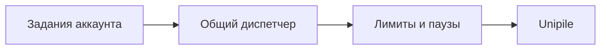

# Лимиты и расписание LinkedIn Automation

Все LinkedIn-функции одного аккаунта используют общий диспетчер. Он не даёт
двум компонентам одновременно менять один аккаунт.

## Приоритет

1. Проверка аккаунта и сверка неизвестного результата.
2. Завершение уже начатого изменения.
3. Подтверждённое заполнение профиля.
4. Ответ на комментарий.
5. Новое приглашение.

## Приглашения

- Не больше одного планового запуска в день на аккаунт.
- Дневной и недельный лимиты задаются на сервере.
- Перед отправкой проверяется общая история за всё время.
- Пропущенный день не увеличивает следующую пачку.
- Отправки идут последовательно с разными паузами.

## Комментарии

`OwnPostCommentMonitor` использует периодический опрос как внутреннюю замену
webhook. Время запуска немного сдвигается случайным образом на сервере.
Конкретную частоту нужно утвердить с Полиной и Кирой.

Зафиксированные значения первой версии:

- сразу после включения, затем 25–35 минут в первые сутки;
- 120–150 минут во вторые сутки, остановка через 48 часов;
- 45–120 секунд между публикациями;
- не более 7 ответов в треде и 30 за сессию.

## Когда остановиться

- аккаунт отключён или требует проверки;
- LinkedIn или Unipile вернул ограничение;
- результат изменения неизвестен;
- достигнут внутренний лимит;
- функция или весь аккаунт выключены администратором.

Числовые лимиты не фиксируются в архитектуре: они задаются конфигурацией перед
реальным запуском.
