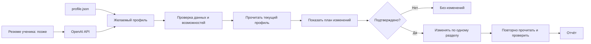

# OwnProfileFiller — предварительная архитектура

## Задача

`OwnProfileFiller` заполняет собственный LinkedIn-профиль ученика. Перед любым
изменением администратор видит план и подтверждает его.

## Откуда берутся данные

- Первый вариант: ручной `profile.json`.
- Позже: сервер получает резюме ученика, передаёт его в OpenAI API и получает
  структурированный черновик профиля.

Черновик от ИИ проходит ту же проверку и предварительный просмотр, что и ручной
файл. Ответ модели никогда не применяется напрямую.

## Разделы профиля

Кандидаты первого этапа:

- Headline;
- About;
- Experience;
- Education;
- Skills;
- Open to Work.

Перед включением каждого раздела нужно отдельно проверить чтение, запись и
контрольное чтение на тестовом аккаунте. Результаты фиксируются в технической
матрице возможностей, которая не входит в этот архитектурный PR.

Если возможность не подтверждена, раздел остаётся выключенным.

## Схема

## Правила

- Работа начинается только с проверенного аккаунта.
- Предварительный просмотр не меняет LinkedIn.
- Интерфейс подтверждает сохранённый на сервере план, а не присылает новый.
- Изменения выполняются последовательно.
- После каждого изменения обязательно контрольное чтение.
- При первой ошибке или несовпадении задание останавливается.
- Куки и ключи API не входят в план, предварительный просмотр и отчёт.

## Уведомление эксперта

После первой ошибки или несовпадения сервер сохраняет заданию статус
`needs_expert_review`. Web Console остаётся источником истины: во вкладке
LinkedIn ученика показываются постоянное уведомление, проблемный шаг и безопасный
код ошибки.

Дополнительно сервер отправляет информационное сообщение в настроенный приватный
Telegram-чат эксперта. Оно содержит имя ученика, ID задания, проблемный раздел,
безопасный код ошибки и ссылку на задание в Web Console. Черновики, резюме,
cookie и полные ответы внешних сервисов в Telegram не отправляются.

Эксперт принимает решение о повторе, отмене или исправлении только в Web Console.
Ошибка доставки Telegram не меняет состояние задания и не скрывает уведомление
в интерфейсе.

## Что нужно проверить

- Какие разделы и поля реально доступны через обычный Unipile API.
- Какие проверки нужно повторять перед live-запуском.
- Как различать создание и изменение Experience/Education.
- Какие ограничения действуют для Skills и Open to Work.

Упрощённая очередь: [docs/QUEUE_FLOW.md](docs/QUEUE_FLOW.md).
