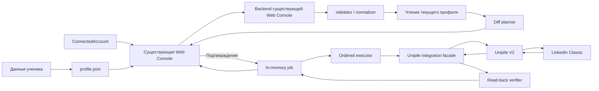

# LinkedIn Profile Filler — архитектура блока

## Назначение

Profile Filler — первый независимый блок `LinkedIn Automation`. Он получает уже
подключённый и проверенный LinkedIn-аккаунт, загружает желаемое состояние из
`profile.json`, показывает preview и выполняет подтверждённые изменения через
Unipile V2.

Текущая реализация ограничена автономным backend-модулем. HTTP endpoints, Web
Console, auth UI и live Unipile/LinkedIn adapter не подключены. Все executable
tests работают только с in-memory fake client и не выполняют сетевых запросов.

Способ получения `ConnectedAccount` находится за отдельной границей и сейчас не
реализуется. Backend Profile Filler может получить текущие session credentials
для подключения или восстановления связи, но они не входят в план, preview или
отчёт.

## Входы и выходы

Вход №1 — результат будущей auth strategy:

```text
ConnectedAccount
|- accountId
|- displayName
|- profileUrl
`- verifiedAt
```

Вход №2 — единый `profile.json` с желаемым состоянием поддерживаемых разделов.
Точный формат: [docs/PROFILE_JSON.md](docs/PROFILE_JSON.md).

Выход:

```text
FillReport
|- verified account identity
|- warnings and skipped fields
|- planned redacted diff
|- per-step execution status
`- final verified / failed / no_changes status
```

Unipile API key, session cookies и proxy credentials являются серверными
секретами и не входят в `profile.json`.

## Поддерживаемые поля V1

- Headline;
- About;
- Experience: безопасный create/edit через upsert;
- Education: безопасный create/edit через upsert;
- Skills: только добавление, цель 100, допустимый итог 95–103;
- Open to Work: включение и обновление.

Вне V1:

- имя и фамилия;
- Location и Postal code;
- фото и обложка;
- Languages, Interests, Courses, Certifications, Projects, Volunteer
  Experience и Recommendations;
- удаление Skills, Experience или Education;
- отключение Open to Work;
- посты, лента, приглашения, connections, SSI и outreach.

## Поток данных



## Внутренние компоненты

```text
profile-filler/
  types.ts       # входные и внутренние контракты
  validator.ts   # tolerant content validation и fatal safety checks
  profile-snapshot.ts # immutable current-state snapshot и статусы разделов
  planner.ts     # current state + desired state -> ProfilePlan
  preview-store.ts # TTL, hash и одноразовый immutable server-side plan
  job-manager.ts # per-account очередь read_only/mutation и cancellation
  service.ts     # orchestration preview -> confirm -> execute
  executor.ts    # строго последовательное выполнение
  report.ts      # redacted итоговый отчёт
  state.ts       # backend session-to-account binding без raw token persistence
  docs/          # очередь и точный контракт profile.json
  tests/         # unit/integration tests с fake Unipile
  fixtures/      # только placeholder data без секретов
```

UI и HTTP entrypoints добавляются непосредственно в существующую Web Console.
Profile Filler остаётся импортируемым модулем бизнес-логики и не содержит
отдельного frontend/backend приложения.

Интеграция с Unipile находится в `src/integrations/unipile/` и отвечает только
за REST paths, headers, payloads, status/checkpoint parsing, rate limits и safe
errors. Бизнес-решения остаются внутри Profile Filler.

## Preview

Preview не изменяет профиль:

1. Проверить `ConnectedAccount` и повторно прочитать identity.
2. Прочитать только необходимые разделы LinkedIn.
3. Проверить и нормализовать `profile.json`.
4. Сохранить immutable read snapshot с hash, TTL и статусом каждого раздела.
5. Сравнить желаемое состояние только с сохранённым snapshot.
6. Исключить unchanged, unsupported, ambiguous, missing и throttled элементы.
7. Показать точный before/after diff, statuses, warnings и skips.
8. Создать короткоживущий server-side plan ID и hash.

Frontend не может заменить payload после preview. Запуск job использует только
неизменяемый server-side plan, привязанный к подтверждённому `account_id`.

Планируемые auth-neutral endpoints:

- `POST /api/linkedin-profile/preview`;
- `POST /api/linkedin-profile/jobs`;
- `GET /api/linkedin-profile/jobs/:jobId`;
- `POST /api/linkedin-profile/jobs/:jobId/cancel`.

Auth endpoints намеренно не определены.

## Два слоя данных

Первый слой только читает и сохраняет состояние:

```text
requested fields
  -> GET current profile
  -> section status: complete | empty | throttled | missing
  -> immutable in-memory snapshot + account binding + hash + TTL
```

`empty` означает, что раздел присутствует в ответе и действительно пуст.
`missing` означает, что запрошенный раздел отсутствует или имеет неожиданную
форму. Эти состояния нельзя объединять.

Второй слой строит plan и выполняет подтверждённые изменения:

```text
saved snapshot
  -> safe diff plan
  -> preview confirmation
  -> verify snapshot ID/hash/account
  -> ordered mutations + read-back
```

`create` и `update` разрешаются только при статусе `complete` или `empty`.
`missing` и `throttled` всегда дают warning и skip. Raw current profile остаётся
на backend; frontend получает только snapshot reference и статусы разделов.

## Validation policy

Fatal до preview:

- некорректный JSON;
- отсутствующий объект `profile`;
- невозможно подтвердить точный LinkedIn account;
- недоступен Unipile;
- невозможно безопасно построить план.

Warnings с безопасным normalize/skip:

- неподдерживаемое или некорректное optional поле;
- больше пяти Skills внутри одной Experience;
- неполная Experience/Education;
- неоднозначный upsert match;
- неразрешённый Open to Work parameter;
- недостаточно Skills для достижения 95.

При warnings финальное действие называется `Продолжить с предупреждениями`.

## Upsert

Experience сопоставляется по:

- company;
- job title;
- start month.

Education сопоставляется по:

- school;
- start month.

При нескольких совпадениях запись пропускается. Если нужный раздел throttled или
неполный, создавать новые записи в нём запрещено.

Experience и Education используют `notify_network=false`.

## Формирование очереди

Внутренний server-side `ProfilePlan.steps[]` содержит:

```text
PlanStep
|- id
|- section
|- action: update | create | add
|- summary
|- before
|- after
|- server-side payload
`- verification rule
```

Web Console получает отдельный `PreviewStep` без `payload` и `verification`:

```text
PreviewStep
|- id
|- section
|- action
|- summary
|- before
`- after
```

Очередь строится только после preview и подтверждения:

1. Headline.
2. About.
3. Изменение существующего Experience.
4. Изменение существующего Education.
5. Skills партиями не более 10.
6. Создание нового Experience.
7. Создание нового Education.
8. Open to Work последним.

В очередь не попадают unchanged поля, unsupported поля, ambiguous upserts,
throttled/incomplete разделы и уже существующие Skills.

В V1 существуют два типа job:

- `read_only`: identity/current-profile reads, validation и preview;
- `mutation`: подтверждённые изменения с обязательным read-back.

Одновременно допускается только одна mutation job на конкретный `accountId`.
Другие аккаунты не блокируются. Read-only job того же аккаунта ждёт завершения
mutation, чтобы не конкурировать с write/read-back последовательностью. Закрытие
браузера не отменяет backend job. Cancellation проверяется между запросами.

Подробная схема: [docs/QUEUE_FLOW.md](docs/QUEUE_FLOW.md).

## Выполнение и read-back

- Все mutations и read-backs выполняются последовательно.
- После каждого write обязателен новый профильный read.
- HTTP 2xx без совпадения read-back не считается успехом.
- Job останавливается после первой failed/unverified операции.
- Uncertain create никогда не повторяется автоматически.
- При timeout или uncertain response сначала выполняется read-back.

## Серверные интервалы

Каждая пауза выбирается заново на backend через
`crypto.randomInt(min, max + 1)`.

| Точка ожидания | Диапазон |
| --- | ---: |
| Подтверждение → первая запись | 10–30 секунд |
| Между обычными изменениями | 45–120 секунд |
| Запись → первый read-back | 7–20 секунд |
| Между повторными read-back | 15–45 секунд |
| Между партиями Skills | 60–150 секунд |

Timing ranges задаются только доверенной server configuration. Frontend и
uploaded JSON не могут ими управлять.

При `api/too_many_requests` учитываются `Retry-After`, заголовки
`x-ratelimit-*` и наш новый случайный запас 5–20 секунд. При
`provider/too_many_requests` job останавливается для ручной проверки: надёжного
времени повтора Unipile не предоставляет. Лимиты и блокировки учитываются на
уровне конкретного аккаунта. Если в API 429 нет корректного `Retry-After`, job
останавливается вместо повтора по выдуманному интервалу.

Источник: [официальная документация Unipile V2 — Rate Limits](https://developer.unipile.com/v2.0/docs/rate-limits).

## Секреты и отчёт

Backend Profile Filler может временно использовать auth credentials при
подключении или восстановлении LinkedIn-сессии. Планировщик, preview, executor
после account binding и отчёт работают через `ConnectedAccount` и не должны
содержать raw credentials.

Запрещено помещать в логи, state, отчёты, fixtures или API responses:

- LinkedIn cookies/password;
- Unipile API key;
- proxy credentials;
- полные provider payloads и raw request bodies.

Отдельный будущий auth frontend может принимать или показывать TOTP secret и
одноразовые 2FA-коды. Сам Profile Filler их не использует. Они не должны
попадать в URL, логи, analytics, browser storage, отчёты или fixtures и должны
очищаться из памяти frontend-компонента после отправки или expiry.

Отчёт содержит только account ID, публичную identity, redacted diff, warnings,
step statuses, HTTP status и безопасные error metadata.

## Тестирование

Default tests используют fake Unipile и не вызывают live LinkedIn:

- identity binding;
- preview immutability;
- warnings, normalization и skips;
- ambiguous upserts и throttled sections;
- Skills batching и максимум 103;
- точный порядок очереди;
- границы timing без реального sleep;
- `429` и `Retry-After`;
- cancellation и stop-on-failure;
- uncertain writes и read-back mismatch;
- различие `empty`, `missing` и `throttled` read snapshots;
- snapshot account/hash/TTL binding;
- secret redaction.

Локальный запуск текущего набора без установки зависимостей и без сети:

```powershell
node --experimental-strip-types src/features/linkedin-automation/profile-filler/tests/run-all.test.ts
```

`node --test` в ограниченной Windows sandbox может пытаться создать дочерний
процесс. Поэтому runner загружает те же `node:test` cases в одном процессе.

Live mutation требует отдельного подтверждения с указанием аккаунта, полей и
ожидаемой очистки.

## Текущий этап

На текущем этапе реализован только изолированный Profile Filler engine, без
подключения к существующей Web Console, без auth UI, session binding и
checkpoint automation:

- `profile.json` contract;
- validator/normalizer;
- diff planner и preview;
- job model;
- fake ProfileClient adapter;
- read-back verifier;
- structured redacted logging;
- локальные unit/integration tests.

Production adapter `src/integrations/unipile/client.ts` существует как отдельная
граница, но `ProfileFillerService` его не импортирует, а текущие tests его не
создают и не вызывают.
