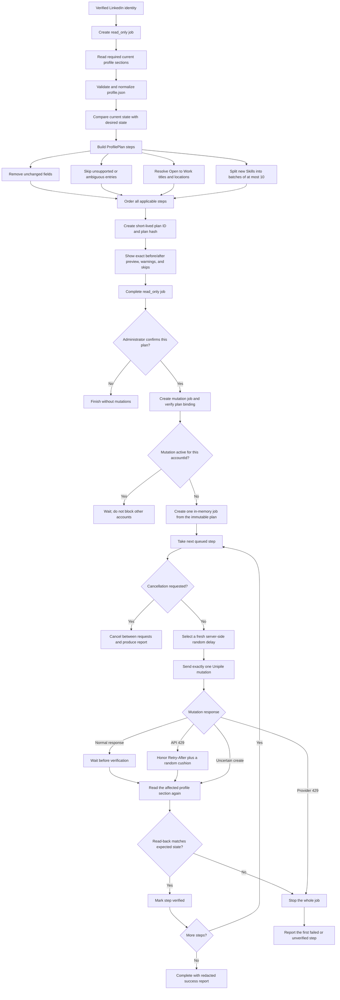

# Profile Fill Queue Flow

This diagram defines two job types: read-only preview work and account-scoped,
read-back-verified mutations. It describes the target Web V1 job manager; the
initial scaffold does not yet implement every box shown here.



## Queue item

Every `ProfilePlan.steps[]` item contains:

```text
PlanStep
|- id
|- section: headline | about | experience | education | skills | open_to_work
|- action: update | create | add
|- summary
|- before
|- after
|- raw server payload
`- verification rule
```

This internal object never leaves the backend. The browser receives a
`PreviewStep` containing only `id`, `section`, `action`, `summary`, `before`,
and `after`.

The browser receives the preview, never an authority to replace the stored
payload. Starting a job references the short-lived server plan; the backend
verifies its hash, expiry, target `account_id`, and confirmed identity.

## Execution order

1. Headline.
2. About.
3. Existing Experience edits.
4. Existing Education edits.
5. Skills batches.
6. New Experience records.
7. New Education records.
8. Open to Work.

## Timing and stopping rules

- All steps and read-backs are serialized; no parallel LinkedIn mutations.
- Mutation serialization is per `accountId`, not global across all profiles.
- A `read_only` job for an account waits while that account has an active
  mutation; independent accounts may proceed under the configured global limit.
- Every wait is selected independently on the backend with
  `crypto.randomInt(min, max + 1)`.
- Closing the browser does not cancel the backend job.
- Cancellation is checked between requests, never in the middle of a write.
- Stop after the first failed or unverified mutation.
- Do not automatically repeat an uncertain create; read back first.
- `api/too_many_requests` follows `Retry-After`, observes `x-ratelimit-*`, and
  adds a fresh 5–20 second safety cushion. Without a usable `Retry-After`, the
  job stops instead of guessing a retry time.
- `provider/too_many_requests` stops for manual review because a reliable retry
  time is unavailable.
