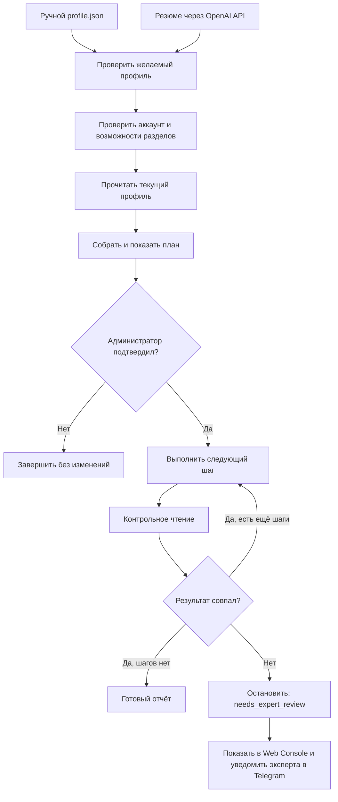

# Очередь OwnProfileFiller

## Правила очереди

- Одно активное задание на изменение для каждого `accountId`.
- Каждый шаг меняет только один раздел или одну безопасную пачку.
- Следующий шаг начинается только после успешного контрольного чтения.
- Неизвестный результат не повторяется автоматически.
- Ошибка или несовпадение сохраняются как `needs_expert_review`.
- Web Console хранит постоянное уведомление и остаётся источником истины.
- Telegram используется только как дополнительный приватный сигнал эксперту.
- Закрытие браузера не отменяет задание на сервере.
- Отчёт не содержит куки, ключей и полных ответов внешнего сервиса.
