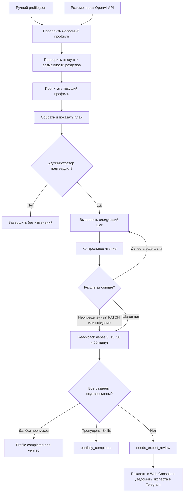

# Очередь OwnProfileFiller

## Правила очереди

- Одно активное задание на изменение для каждого `accountId`.
- Каждый шаг меняет только один раздел или одну безопасную пачку.
- Неопределённый PATCH и неподтверждённое создание блокируют следующие записи.
- Неизвестный результат запускает только read-back; PATCH не повторяется автоматически.
- Статус `verifying` и время следующего чтения сохраняются и переживают перезапуск backend.
- После последней проверки несовпадение сохраняется как `needs_expert_review`.
- Результат хранится в Noco; Web Console возобновляет наблюдение после reload и ошибок чтения.
- Telegram используется только как дополнительный приватный сигнал эксперту.
- Закрытие браузера не отменяет задание на сервере.
- Отчёт не содержит куки, ключей и полных ответов внешнего сервиса.
