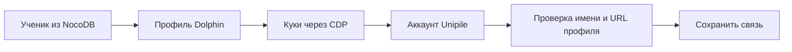

# Student Admin — предварительная архитектура

## Задача

`Student Admin` — раздел существующей Web Console для управления функциями LinkedIn
учеников. Он не создаёт новый справочник и не меняет NocoDB.

## Связывание аккаунта

Связь содержит:

- `studentId`;
- `dolphinProfileId`;
- `accountId`;
- проверенный профиль владельца;
- состояние подключения.

## Что показывает экран

- ученика и подключённый LinkedIn-профиль;
- состояние аккаунта;
- включены ли `OwnProfileFiller`, `PeopleConnectionsInvitationSender` и
  `OwnPostCommentResponder`;
- последние задания и понятные ошибки;
- постоянную очередь заданий со статусом `needs_expert_review`;
- историю приглашений, наблюдений и действий.

## Правила

- Один активный `accountId` нельзя связать с двумя учениками.
- Включение функции не означает, что обработчик уже запущен: интерфейс отдельно
  показывает желаемое и фактическое состояние.
- Архивация отключает автоматизацию, но сохраняет связь и историю.
- Интерфейс не получает куки, ключи API и полные ответы внешних сервисов.
- Telegram только сообщает о задании; повтор, отмена и исправление доступны в Web Console.
- Создание, удаление и изменение карточек NocoDB — отдельная задача.
