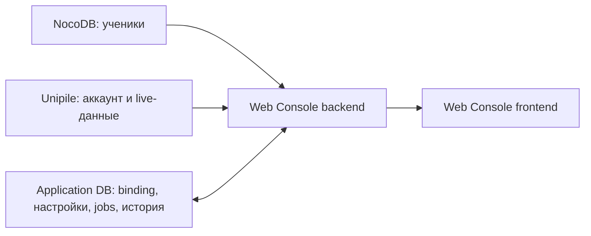

# Student Admin — архитектура

## Назначение

`Student Admin` — LinkedIn-раздел существующей Web Console. Он связывает
ученика с проверенным Unipile account, показывает состояние всех LinkedIn-фич и
даёт безопасно включать, выключать и архивировать автоматизацию.

Это не отдельное приложение и не новый справочник учеников.

## Источники данных



- NocoDB остаётся бизнес-источником учеников и читается через существующую
  интеграцию.
- Application DB хранит только enrollment в автоматизацию, account binding,
  feature settings, jobs и аудит.
- Unipile остаётся источником текущего состояния аккаунта, профиля, постов и
  отношений.
- Frontend не обращается к NocoDB, Unipile или OpenAI напрямую.

Существующие таблицы NocoDB на этом этапе не меняются. Команда «Добавить
ученика» означает выбрать существующего ученика NocoDB и создать enrollment в
Application DB. Создание или удаление бизнес-записи NocoDB — отдельная задача.

## Проверенное связывание аккаунта

```text
выбрать studentId из NocoDB
  -> выбрать доступный Unipile accountId
  -> GET account
  -> GET own profile
  -> показать имя + profile URL
  -> отдельное подтверждение администратора
  -> UNIQUE active binding
```

Binding содержит `studentId`, `accountId`, нормализованную identity,
`verifiedAt` и статус. Нельзя привязать один активный `accountId` к двум
ученикам. Если после reconnect пришёл другой ID или изменилась identity,
автоматизация блокируется до повторного подтверждения.

## Desired и actual state

Для каждой фичи хранятся два независимых состояния:

```text
desired: enabled | disabled
actual:  stopped | ready | running | paused_account | degraded | error
```

Переключатель UI меняет только `desired`. Worker переводит `actual` после
проверки account health, конфигурации и доступности storage. Поэтому UI не
показывает «работает» сразу после клика.

Отключение фичи:

1. запрещает создавать новые jobs;
2. отменяет ещё не начатые claims;
3. не считает уже отправленный сетевой запрос отменённым;
4. сохраняет историю, `uncertain` и audit events;
5. требует reconciliation для возможной незавершённой мутации.

## Архивация

Архивация ученика отключает все LinkedIn-фичи и скрывает enrollment из
рабочего списка, но не удаляет:

- ученика из NocoDB;
- account binding и подтверждённую identity;
- историю приглашений;
- watches, comments и audit events.

Восстановление возвращает enrollment с `desired=disabled`; фичи включаются
заново явно. Hard delete и privacy erasure требуют отдельного подтверждения и
аудируемого сценария.

## Экран

Минимальные вкладки:

- `Обзор`: ученик, account identity, connection health и последние ошибки;
- `Фичи`: desired/actual для Profile Filler, Connection Inviter и Comment
  Monitor;
- `Коннекты`: дневной run, текущий расход safety budgets и постоянная история;
- `Посты`: live-список личных постов и активные 48-часовые watches;
- `История`: безопасные automation events без provider payloads и секретов.

## Планируемые backend contracts

```text
GET    /api/linkedin/students
POST   /api/linkedin/students/{studentId}/enroll
POST   /api/linkedin/students/{studentId}/archive
POST   /api/linkedin/students/{studentId}/restore
PUT    /api/linkedin/students/{studentId}/account
PATCH  /api/linkedin/students/{studentId}/features/{feature}
GET    /api/linkedin/students/{studentId}/history
```

Это целевые контракты, а не уже существующие routes. Все команды требуют
administrator authorization, CSRF protection, idempotency key и server-side
validation. Account binding дополнительно требует отдельного confirmation
token, привязанного к прочитанной identity.

## Реакция на account lifecycle

- `running`: worker может сверить identity и перейти в `ready`;
- `disconnected`: desired сохраняется, actual становится `paused_account`;
- `errored`: ждать автоматического восстановления Unipile;
- `paused`: показать проблему subscription/configuration;
- reconnect: дождаться `account.status.running`, проверить тот же account и
  identity, выполнить reconciliation, затем вернуть фичи в `ready`.

Подробности: [ACCOUNT_LIFECYCLE.md](../account-connection/docs/ACCOUNT_LIFECYCLE.md)
и [DATA_BOUNDARIES.md](../core/storage/DATA_BOUNDARIES.md).

## Вне текущего этапа

- изменение NocoDB;
- реализация UI/routes;
- выбор Application DB и миграции;
- auth/reconnect формы;
- live LinkedIn mutations;
- VDS deployment.
