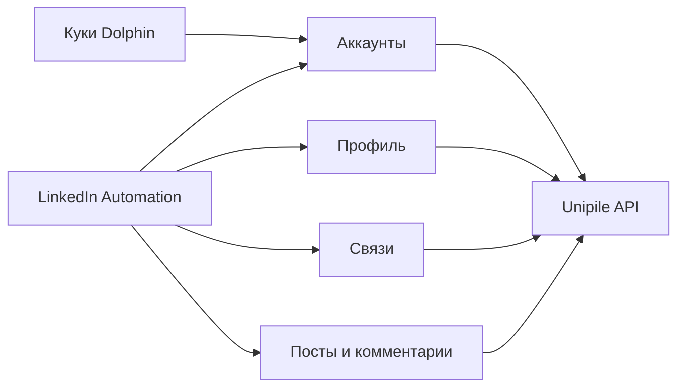

# Адаптер Unipile — предварительная архитектура

## Роль

`src/integrations/unipile` — единственная граница между бизнес-компонентами и
Unipile API. Бизнес-логика не знает URL, формат ответов и ошибки внешнего
сервиса.

## Части адаптера

| Порт | Ответственность |
| --- | --- |
| Аккаунты | Подключение куки, переподключение, состояние аккаунта и проверка владельца |
| Профиль | Чтение, изменение и контрольное чтение собственного профиля |
| Связи | Поиск людей, приглашения и состояние связей |
| Посты и комментарии | Собственные посты, комментарии, ответы и контрольное чтение |

## Правила

- Куки принимаются только как кратковременный вход на сервере.
- Интерфейс никогда не вызывает Unipile напрямую.
- Для списков читаются все страницы.
- Чтение можно повторять только при безопасной временной ошибке.
- Изменения не получают общий автоматический повтор.
- Потеря ответа после изменения возвращается как `uncertain`.
- Адаптер возвращает внутренний понятный формат и безопасные ошибки, а не полный
  ответ Unipile.

Конкретные адреса запросов, форматы данных и тесты относятся к реализации, а не
к этому архитектурному документу.
