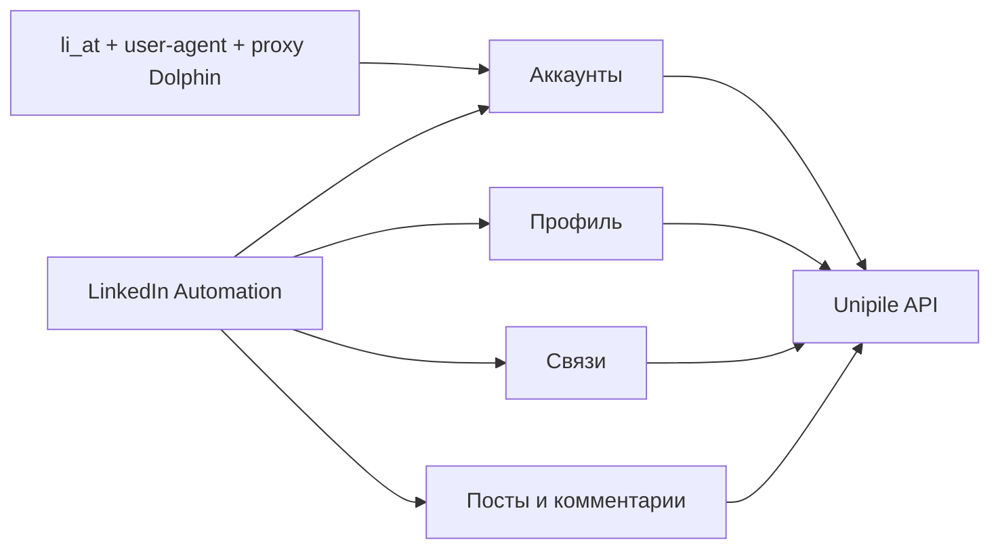

# Адаптер Unipile

## Роль

`src/integrations/unipile` — единственная граница между бизнес-компонентами и
Unipile API. Бизнес-логика не знает URL, формат ответов и ошибки внешнего
сервиса.

## Части адаптера

| Порт | Ответственность |
| --- | --- |
| Аккаунты | Auth Intent v2, переподключение, состояние аккаунта и проверка владельца |
| Профиль | Чтение, изменение и контрольное чтение собственного профиля |
| Связи | Поиск людей, приглашения и состояние связей |
| Посты и комментарии | Собственные посты, комментарии, ответы и контрольное чтение |

## Правила

- Для LinkedIn передаются `li_at`, точный user-agent, `products: ["classic"]` и обязательный proxy.
- Подключение: `POST /v2/auth/intent`; проверка: `GET /v2/accounts/{id}` и `GET /v2/{id}/users/me`.
- `account_id` передаётся при reconnect; автоматический прокси Unipile запрещён.
- DataImpulse `gw.dataimpulse.com` передаётся как HTTPS: v2 возвращает `api/proxy_error` при SOCKS5.
- Секреты принимаются только как кратковременный вход на сервере.
- Интерфейс никогда не вызывает Unipile напрямую.
- Для списков читаются все страницы.
- Чтение можно повторять только при безопасной временной ошибке.
- Изменения не получают общий автоматический повтор.
- Потеря ответа после изменения возвращается как `uncertain`.
- Адаптер возвращает внутренний понятный формат и безопасные ошибки, а не полный
  ответ Unipile.
