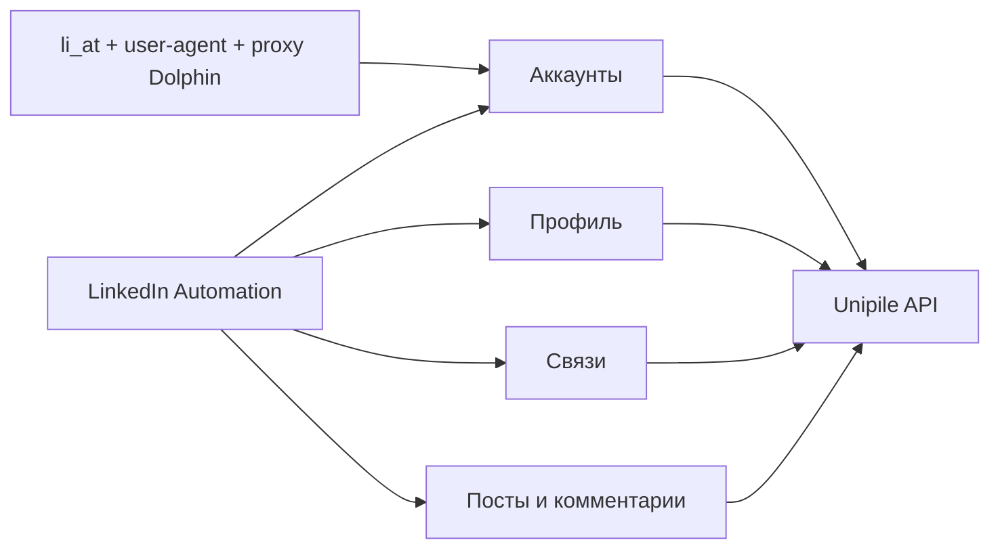

# Адаптер Unipile

## Роль

`src/integrations/unipile` — единственная граница между бизнес-компонентами и
Unipile API. Бизнес-логика не знает URL, формат ответов и ошибки внешнего
сервиса.

```mermaid
flowchart LR
    D["li_at + user-agent + proxy Dolphin"] --> A["Аккаунты"]
    F["LinkedIn Automation"] --> A
    F --> P["Профиль"]
    F --> R["Связи"]
    F --> C["Посты и комментарии"]
    A --> U["Unipile API"]
    P --> U
    R --> U
    C --> U
```

## Части адаптера

| Порт | Ответственность |
| --- | --- |
| Аккаунты | Auth Intent v2, переподключение, состояние аккаунта и проверка владельца |
| Профиль | Чтение, изменение и контрольное чтение собственного профиля |
| Связи | Поиск людей, приглашения и состояние связей |
| Посты и комментарии | Собственные посты, комментарии, ответы и контрольное чтение |

## Правила

`invitation-withdrawal.ts` читает все отправленные ожидающие приглашения с
`created_at` и отзывает выбранное через V2 `POST .../relation-requests/:id/cancel`.
`sent-invitations.ts` проверяет полноту страниц. Неверный или неполный ответ
блокирует отзыв; POST автоматически не повторяется.

- Для LinkedIn передаются `li_at`, точный user-agent, `products: ["classic"]` и обязательный proxy.
- Подключение: `POST /v2/auth/intent`; проверка: `GET /v2/accounts/{id}` и `GET /v2/{id}/users/me`.
- `account_id` передаётся при reconnect; автоматический прокси Unipile запрещён.
- DataImpulse `gw.dataimpulse.com` передаётся как HTTPS: v2 возвращает `api/proxy_error` при SOCKS5.
- Секреты принимаются только как кратковременный вход на сервере.
- Интерфейс никогда не вызывает Unipile напрямую.
- Для списков читаются все страницы.
- Чтение можно повторять только при безопасной временной ошибке.
- Изменения не получают общий автоматический повтор.
- Потеря ответа после изменения возвращается как `uncertain`.
- При установленной политике оркестратора `http-client.ts` проводит все запросы
  ручных и автоматических фич через общую FIFO-очередь проверенного LinkedIn ID.
  Для одного аккаунта выполняется один HTTP-запрос, интервал между началами —
  случайные 10–20 секунд. Разные аккаунты имеют независимые очереди.
  Stop, право отправки и сохранённый Retry-After проверяются после ожидания;
  сетевой timeout начинается только при отправке. Журнал отмечает `request_queue_wait`.
  После Stop чтение для проверки уже отправленного остаётся доступно.
  Длинные паузы фич засчитываются, очередной интервал не прибавляется к ним.
  Внутренние HTTP-очереди фич при этом не включают второй таймер. Ожидание
  общей очереди исключается из активного времени задания, но не продлевает
  общий срок выполнения и не освобождает незавершённую операцию для новой записи.
  Без установленной политики (отдельные клиенты/CLI) прежнее поведение сохраняется.
  Очередь действует внутри backend; SQL-владение оркестратора защищает от второго writer.
- Адаптер возвращает внутренний понятный формат и безопасные ошибки, а не полный
  ответ Unipile.

HTTP-клиент принимает необязательный `requestOptions.onResponse` для диагностики.
Клиент передаёт только HTTP status, разрешённое значение `X-Cache` и числовой
`Age`. Это не меняет запросы, retry или политику кэширования; ошибка наблюдателя игнорируется.
Connection Inviter использует его для журнала физических запросов. При поиске конкретного
pending-приглашения разрешён ранний выход после положительного совпадения; отсутствие
по-прежнему требует полного корректного списка.

Ошибки HTTP сохраняют `req_id` Unipile, тип и текст `title`, `detail`, `message`.
Фиксируется тип содержимого известных полей (отсутствует, null, пустая строка,
строка, объект или массив) и количество остальных полей, без их значений и имён.
Не-JSON и пустой ответ отмечаются отдельно, их содержимое не записывается. Из текста удаляются
ключ клиента, отражённые значения тела/адреса запроса, пароли, cookie, токены,
URL и email; произвольный объект ответа не записывается. Адрес в диагностике —
шаблон с `:id`, числовыми limit/offset и признаком наличия cursor, без его значения.
Оркестратор передаёт эту диагностику в существующий журнал вместе с временем,
аккаунтом и этапом. Запросы, интервалы и правила повторов от наблюдения не меняются.

Учёт различает `request_prepared` до последней проверки прав, `request_started`
после вызова транспорта и `request_not_sent` при отказе до отправки. Физические
попытки считаются по `request_started`. Контекст задачи/прогона/действия наследуется
внутренними вызовами и сохраняется в очереди. Сбой журнала после отправки не
заменяет реальный ответ провайдера; начатый запрос завершается до освобождения writer.

Ошибочный список с HTTP 200 не равен пустому результату и не обозначается как HTTP 500.
`read-retry.ts` задаёт безопасную причину ошибки чтения: формат, ID/тип записи,
номер страницы и позиции, изменение количества, повтор cursor или неполнота.
Содержимое записей и значения cursor в эту диагностику не попадают. Оркестратор
повторяет такое чтение после сохранённой паузы в пределах существующего срока задачи.
В отзыве 5xx/timeout и ошибки списка также сохраняют срок продолжения и утверждённую
очередь; неизвестный результат отмены проверяется чтением без повторного POST.

Отзыв использует cursor, если он пришёл, иначе offset по числу сырых строк.
Совпадающие ID объединяются только при согласованной дате и подтверждённой полноте
по неизменному total_count. Повтор без прогресса, отсутствие total_count при дублях,
пропущенные записи или смена total_count не дают разрешения на отмену/подтверждение.
Чтение ограничено 100 страницами. Здоровый прогон не получает дополнительных запросов.

Комментарии отклоняют ошибочные массивы, повтор/обрыв цепочки страниц и достижение
предела полного чтения. При total_count без cursor продолжают по offset. Проверка
известного ответа может закончиться на его ID. Выбор двух последних постов явно
ограничен первой страницей: это выбор кандидатов, а не доказательство отсутствия ответа.
Проверка лайков сохраняет total_count между страницами и учитывает cursor; изменение
выдачи не считается отсутствием лайка. Поиск параметров профиля не кэширует ошибочный
ответ как пустой каталог. Ошибки чтения не разрешают повторять внешнюю запись.
